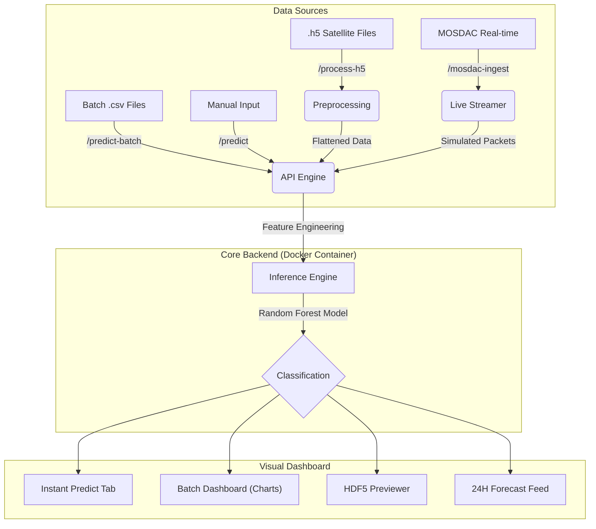

# 🏗️ Turbulence Insight: Technical Manual & Documentation

Welcome to the comprehensive technical manual for the **Turbulence Insight** system. This document provides a deep-dive into the architectural, mathematical, and operational layers of the platform.

---

## 1. System Architecture

The following diagram illustrates the flow of data from ingestion (Satellite/Manual) through the preprocessing and inference engines to the UI layer.



---

## 2. Feature Engineering & Mathematical Foundations

To achieve high-accuracy turbulence detection, the system derives synthetic features from raw meteorological data.

### A. Vertical Wind Shear ($V_{shear}$)
Wind shear is a critical indicator of atmospheric instability. We calculate the absolute differential between wind speeds at different altitudes.
$$\Delta V = |V_{100m} - V_{10m}|$$
*   **Significance**: High $\Delta V$ values indicate rapid changes in wind velocity over short vertical distances, frequently corresponding to clear-air turbulence (CAT).

### B. Dewpoint Depression ($T_{dep}$)
Determining the moisture gap in the lower atmosphere helps identify vertical convective potential.
$$T_{dep} = T_{2m} - D_{2m}$$
*   **Significance**: Low depression indicates near-saturation, which can lead to cloud-based turbulence, while high depression in high-wind zones points toward dry-layer instability.

---

## 3. Operational Ingestion Pipelines

### 🛰️ The MOSDAC-X (Live Stream)
The system uses a simulated high-concurrency stream to mimic satellite reception. 
*   **CTP (Cloud Top Pressure)**: Inferred from infrared radiances.
*   **CTT (Cloud Top Temperature)**: Critical for identifying deep convective systems.
*   **Forecast Logic**: The **24-hour predictive forecast** uses a trend-averaging algorithm to project whether atmospheric conditions are **Stable**, **Clearing**, or showing **High Shear**.

### 📐 HDF5 Transformation
Satellite products are typically stored in HDF5 (Hierarchical Data Format v5). Our converter:
1.  Recursively scans for **Geophysical Data** groups.
2.  Normalizes coordinate systems (Lat/Lon).
3.  Flattens multi-dimensional radiance matrices into 1D observation vectors suitable for the Random Forest model.

---

## 4. REST API Contract

For external integrations (e.g., in-flight tablets or external weather stations), the API provides the following interface.

### `POST /predict`
**Request Body**:
```json
{
  "rows": [
    {
      "lat": 28.6,
      "lon": 77.2,
      "temperature_2m": 25,
      "wind_speed_100m": 12,
      "wind_speed_10m": 5,
      "surface_pressure": 1013
    }
  ]
}
```

**Response**:
```json
{
  "results": [
    {
      "index": 0,
      "pred_text": "Moderate",
      "probs": [0.07, 0.80, 0.13]
    }
  ]
}
```

---

## 5. Compatibility & Maintenance

### Python 3.14+ Monkey-Patch
To ensure longevity as the Python ecosystem evolves, the system includes a compatibility shim for `pkgutil`.
```python
if not hasattr(pkgutil, 'get_loader'):
    # Polyfill for newer importlib structures
    def get_loader(name):
        spec = importlib.util.find_spec(name)
        return spec.loader if spec else None
    pkgutil.get_loader = get_loader
```

### Production Tuning
*   **Server**: Gunicorn with **Sync workers**.
*   **Timeout**: 120s (recommended for large HDF5 processing).
*   **Host**: `0.0.0.0:8080`.
